---
## Front matter
lang: ru-RU
title: Отчёт по лабораторной работе №4
author: Дупленских Василий Викторович
institute: РУДН, Москва, Россия
date: 25 апреля 2022

## Formatting
toc: false
slide_level: 2
theme: metropolis
header-includes: 
 - \metroset{progressbar=frametitle,sectionpage=progressbar,numbering=fraction}
 - '\makeatletter'
 - '\beamer@ignorenonframefalse'
 - '\makeatother'
aspectratio: 43
section-titles: true
---

# Цель работы:

Изучить основы программирования в оболочке ОС UNIX. Научится писать более
сложные командные файлы с использованием логических управляющих конструкций
и циклов.

# Выполнение лабораторной работы:
## 1. Определяю полное имя моего домашнего каталога и перехожу в этот каталог:
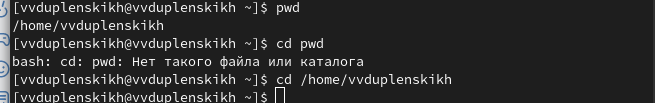

## 2. Перехожу в каталог /tmp, вывожу его содержание, определяю есть ли подкаталог cron в каталоге /var/spool. Перехожу в мой домашний каталог и вывожу его содержимое. Определяю, владелец файлов и подкаталогов:
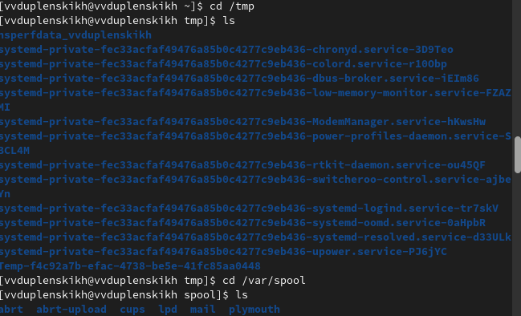
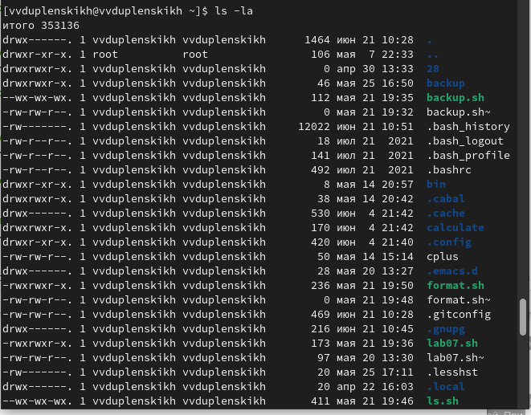

## 3. В домашнем каталоге создаю новый катлог с именем newdir. В этом каталоге создаю каталог с именем morefun. В домашнем каталоге создаю три новых каталога с именами letters, memos, misk. Затем удаляю эти каталоги одной командой. Пробую удалить ранее созданный каталог ~/newdir командой rm. Проверяю, удален ли каталог. Удаляю каталог ~/newdir/morefun из домашнего каталога. Проверяю, удален ли каталог:
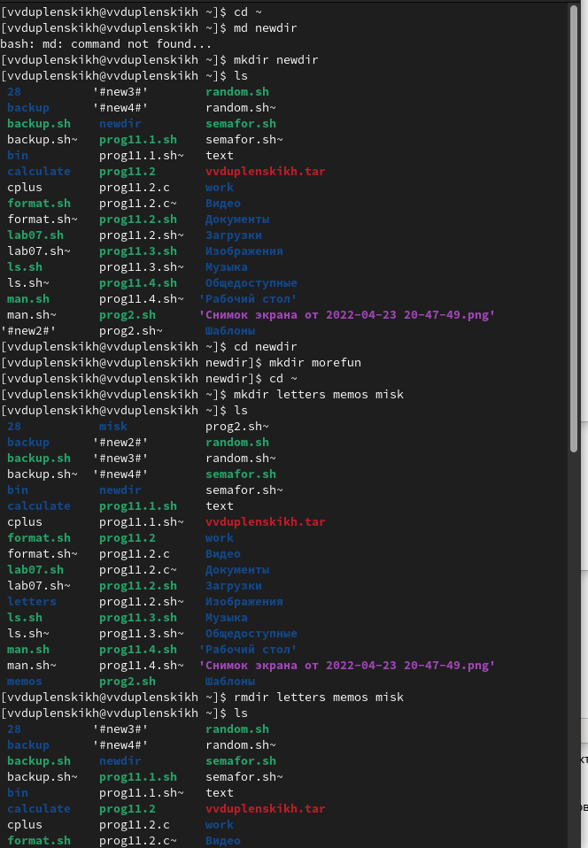
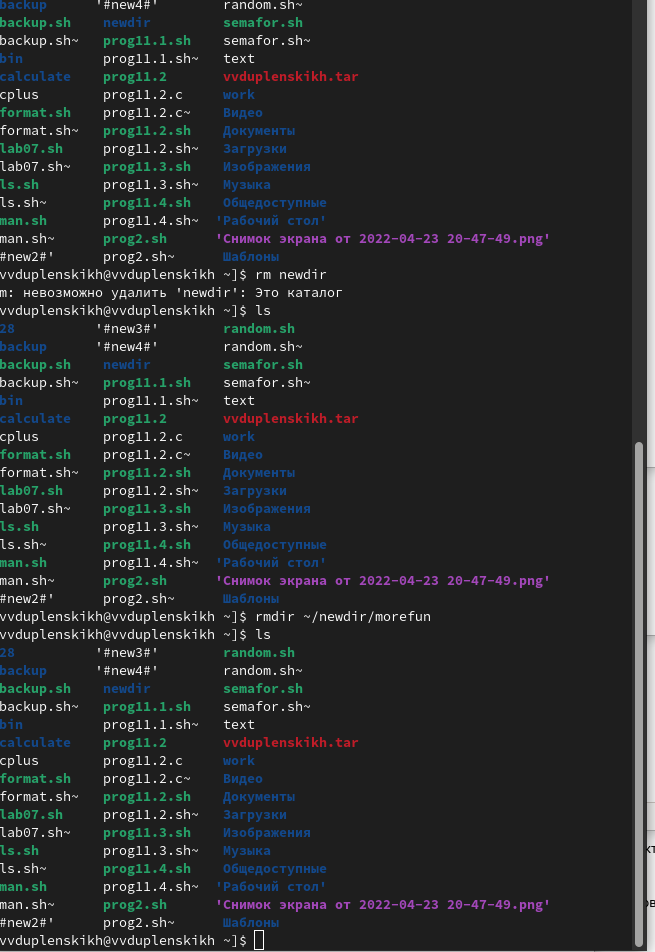

## 4. С помощью команды man определяю, какую опцию команды ls надо использовать для просмотре содержимого не только указанного каталога но и подкаталогов, входящих в него.
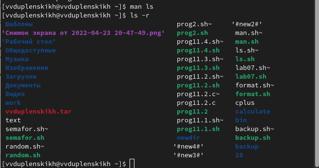

## 5. С помощью команды man определяю, какую опцию команды ls надо использовать для сортировки по времени последнего изменения выводимого списка содержимого каталога с развёрнутым описанием файлов.
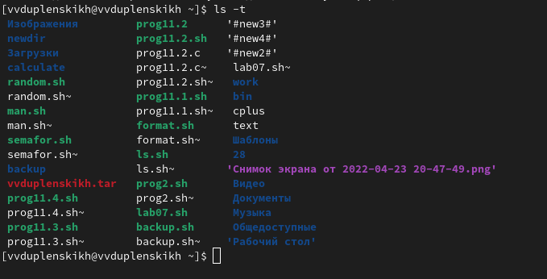

## 6. Использую команду man для просмотра описания следующих команд: cd, pwd, mkdir, rmdir, rm. Поясняю основные опции этих команд. Cd - команда перемещения по файловой системе. Pwd - показывает директорию в которой находится пользователь. Mkdir - команда, создающая новую директорию. Rmdir - команда, которая удаляет директорию. Rm - команда, которая удаляет файлы.
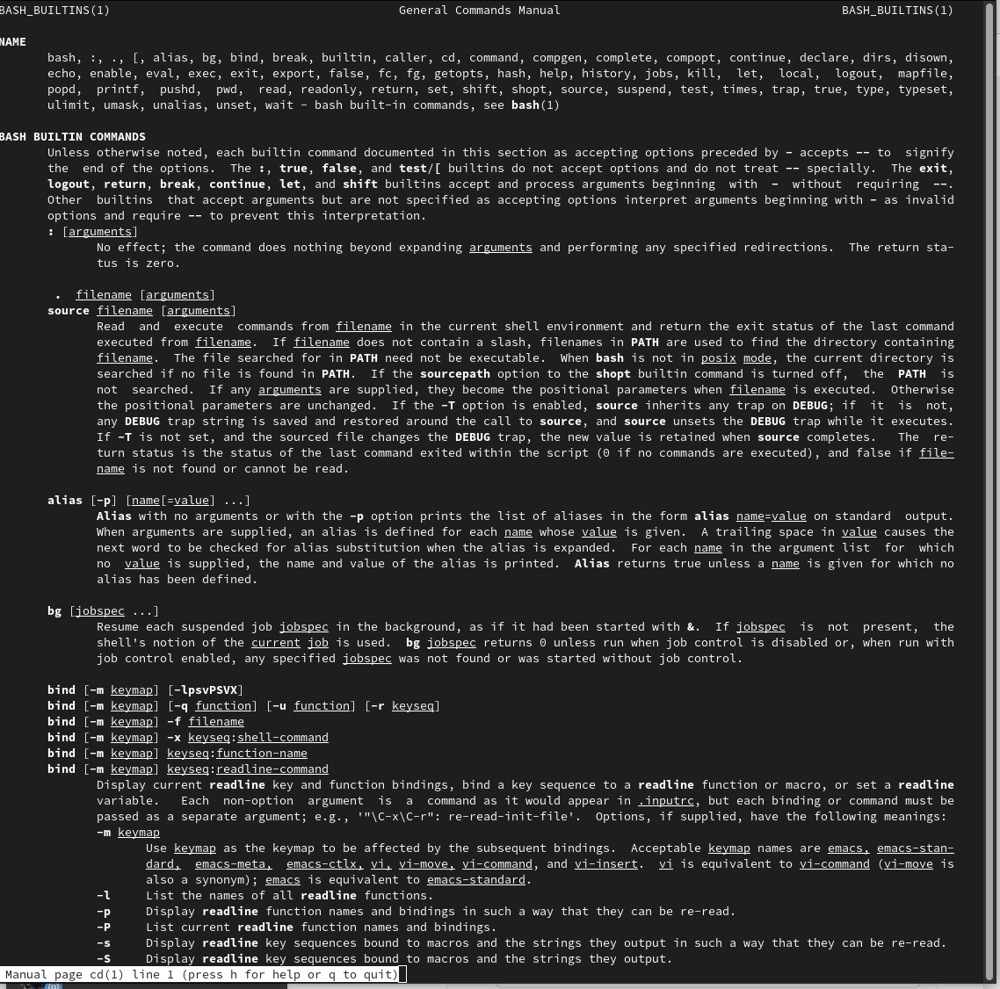
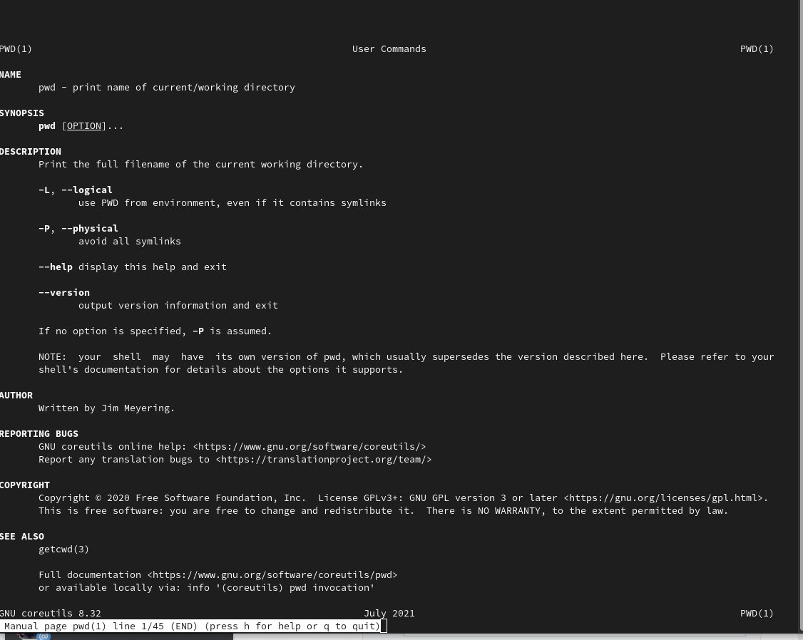
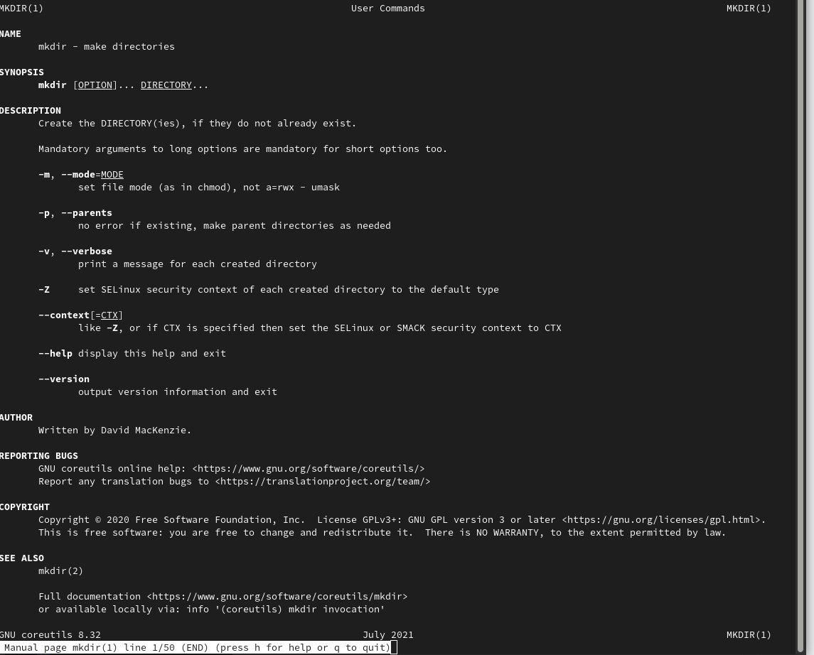
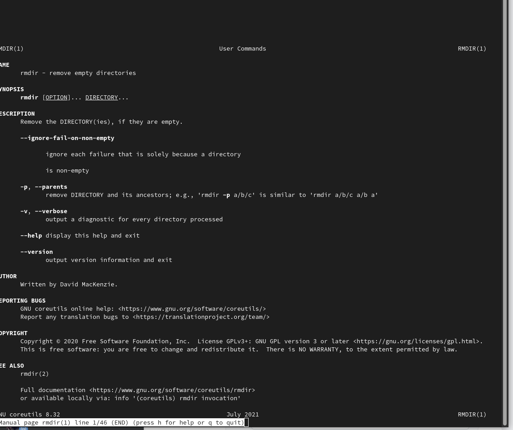
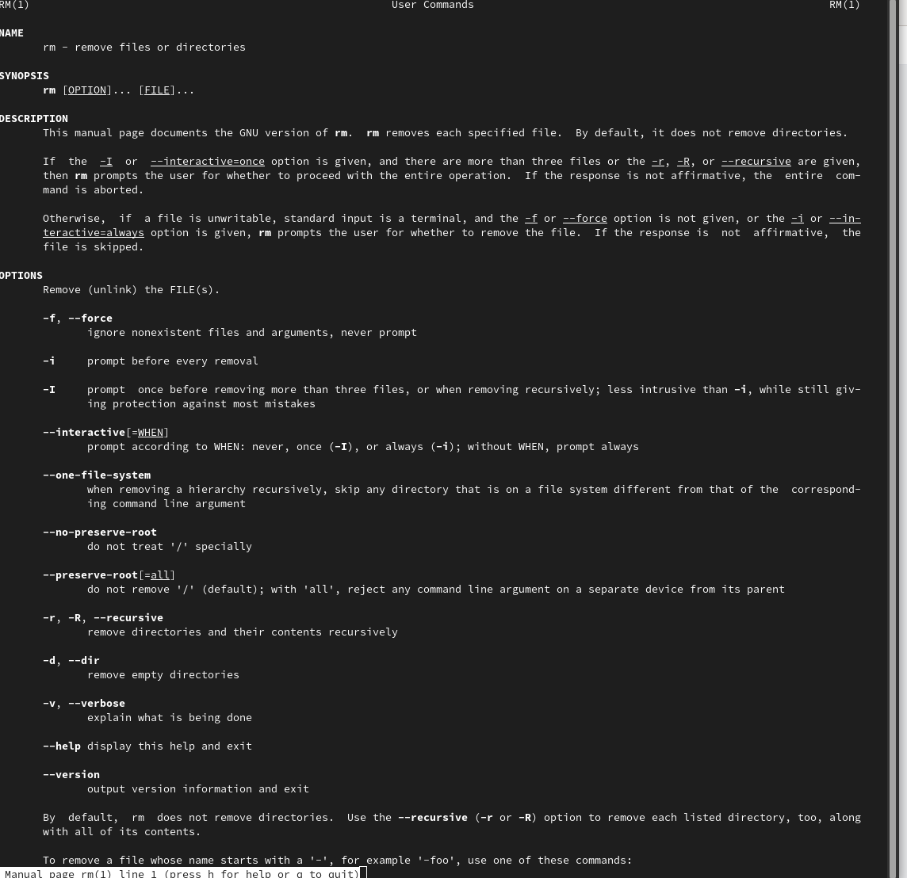

## 7. Используя информацию, полученную при помощи команды history, выполняю модифаикацию и исполнение нескольких команд из буфера команд.
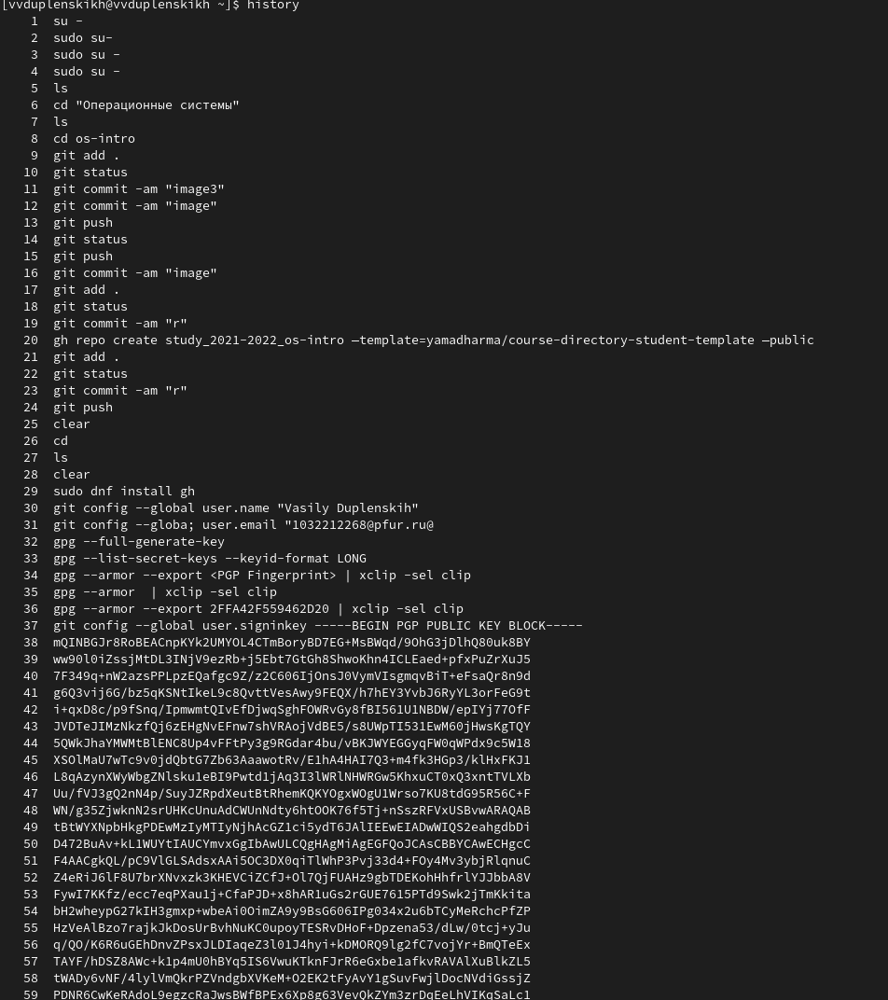

# Вывод:
Мы приобрели практические навыки взаимодействия пользователя с системой посредством командной строки.
