---
# Front matter
lang: ru-RU
title: "Отчёт по лабораторной работе №4"
subtitle: "Дисциплина: Операционные системы"
author: "Дупленских Василий Викторович"

# Formatting
toc-title: "Содержание"
toc: true # Table of contents
toc_depth: 2
lof: true # List of figures
lot: true # List of tables
fontsize: 12pt
linestretch: 1.5
papersize: a4paper
documentclass: scrreprt
polyglossia-lang: russian
polyglossia-otherlangs: english
mainfont: PT Serif
romanfont: PT Serif
sansfont: PT Sans
monofont: PT Mono
mainfontoptions: Ligatures=TeX
romanfontoptions: Ligatures=TeX
sansfontoptions: Ligatures=TeX,Scale=MatchLowercase
monofontoptions: Scale=MatchLowercase
indent: true
pdf-engine: lualatex
header-includes:
  - \linepenalty=10 # the penalty added to the badness of each line within a paragraph (no associated penalty node) Increasing the value makes tex try to have fewer lines in the paragraph.
  - \interlinepenalty=0 # value of the penalty (node) added after each line of a paragraph.
  - \hyphenpenalty=50 # the penalty for line breaking at an automatically inserted hyphen
  - \exhyphenpenalty=50 # the penalty for line breaking at an explicit hyphen
  - \binoppenalty=700 # the penalty for breaking a line at a binary operator
  - \relpenalty=500 # the penalty for breaking a line at a relation
  - \clubpenalty=150 # extra penalty for breaking after first line of a paragraph
  - \widowpenalty=150 # extra penalty for breaking before last line of a paragraph
  - \displaywidowpenalty=50 # extra penalty for breaking before last line before a display math
  - \brokenpenalty=100 # extra penalty for page breaking after a hyphenated line
  - \predisplaypenalty=10000 # penalty for breaking before a display
  - \postdisplaypenalty=0 # penalty for breaking after a display
  - \floatingpenalty = 20000 # penalty for splitting an insertion (can only be split footnote in standard LaTeX)
  - \raggedbottom # or \flushbottom
  - \usepackage{float} # keep figures where there are in the text
  - \floatplacement{figure}{H} # keep figures where there are in the text
---

# Цель работы:

Изучить основы программирования в оболочке ОС UNIX. Научится писать более
сложные командные файлы с использованием логических управляющих конструкций
и циклов.

# Выполнение лабораторной работы:
## 1. Определяю полное имя моего домашнего каталога и перехожу в этот каталог:
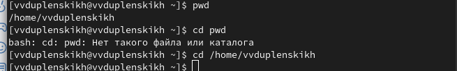

## 2. Перехожу в каталог /tmp, вывожу его содержание, определяю есть ли подкаталог cron в каталоге /var/spool. Перехожу в мой домашний каталог и вывожу его содержимое. Определяю, владелец файлов и подкаталогов:
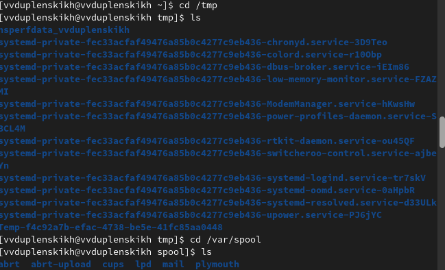
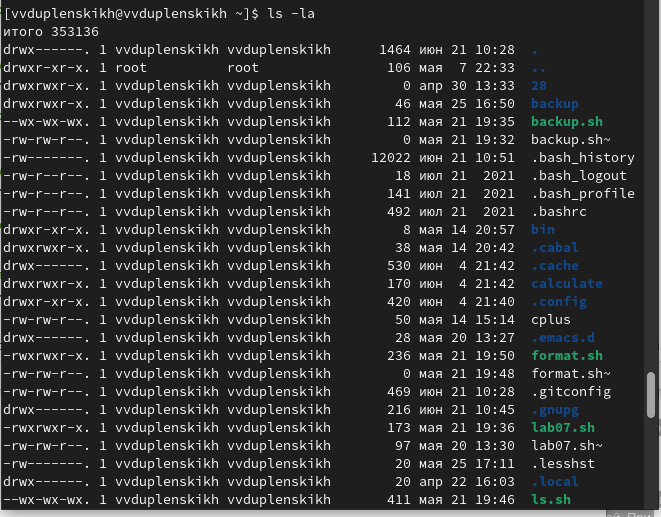

## 3. В домашнем каталоге создаю новый катлог с именем newdir. В этом каталоге создаю каталог с именем morefun. В домашнем каталоге создаю три новых каталога с именами letters, memos, misk. Затем удаляю эти каталоги одной командой. Пробую удалить ранее созданный каталог ~/newdir командой rm. Проверяю, удален ли каталог. Удаляю каталог ~/newdir/morefun из домашнего каталога. Проверяю, удален ли каталог:
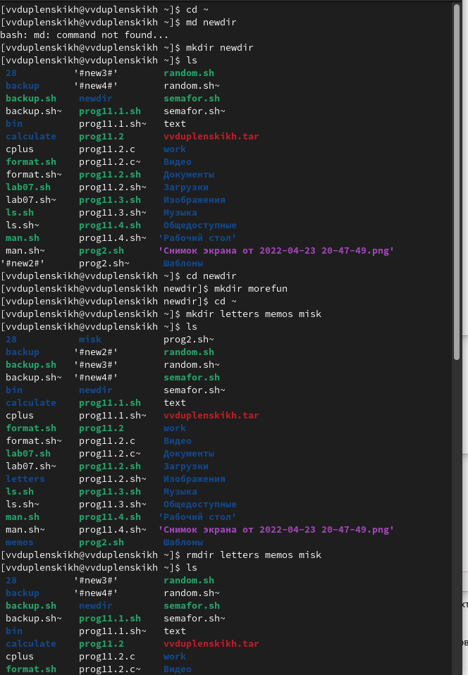
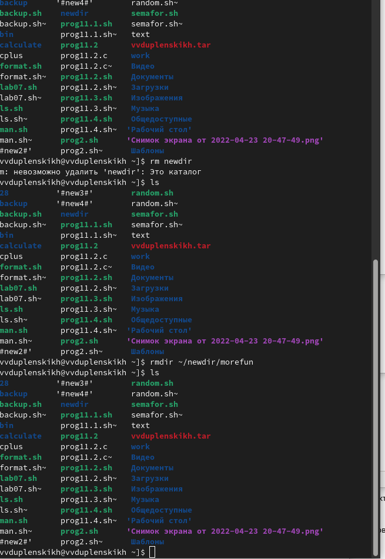

## 4. С помощью команды man определяю, какую опцию команды ls надо использовать для просмотре содержимого не только указанного каталога но и подкаталогов, входящих в него.
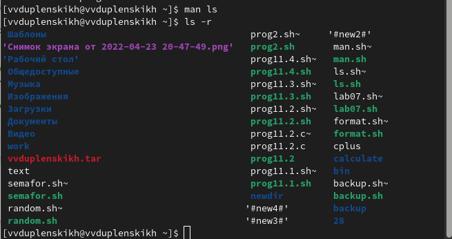

## 5. С помощью команды man определяю, какую опцию команды ls надо использовать для сортировки по времени последнего изменения выводимого списка содержимого каталога с развёрнутым описанием файлов.
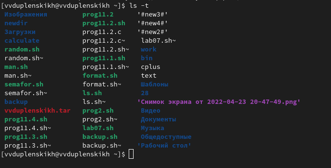

## 6. Использую команду man для просмотра описания следующих команд: cd, pwd, mkdir, rmdir, rm. Поясняю основные опции этих команд. Cd - команда перемещения по файловой системе. Pwd - показывает директорию в которой находится пользователь. Mkdir - команда, создающая новую директорию. Rmdir - команда, которая удаляет директорию. Rm - команда, которая удаляет файлы.
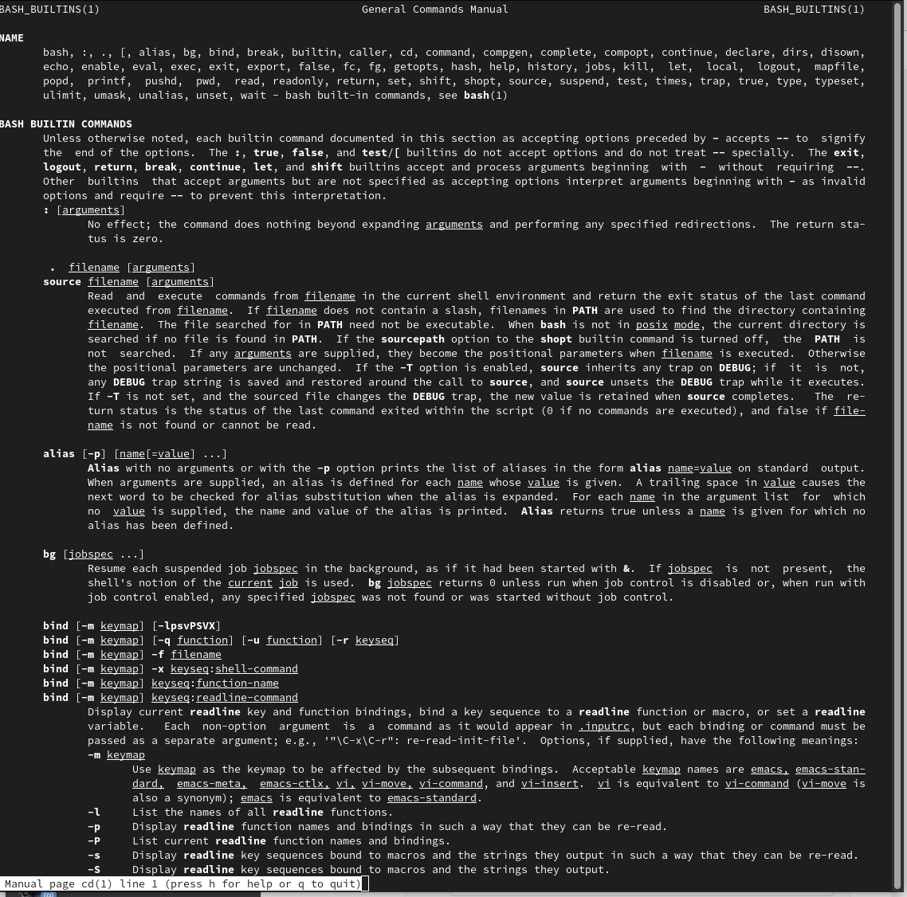
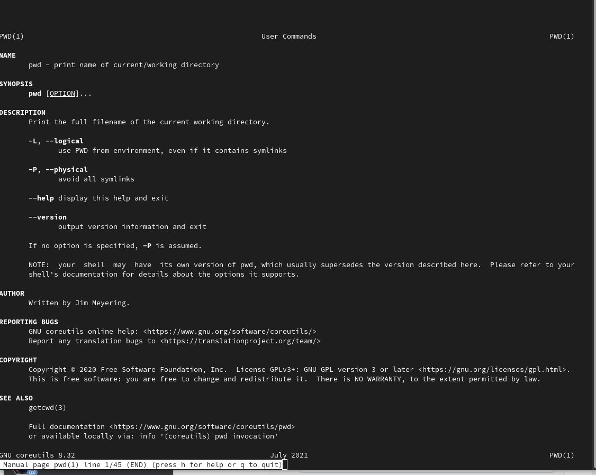
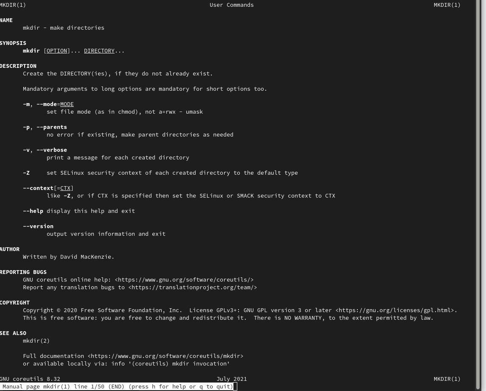
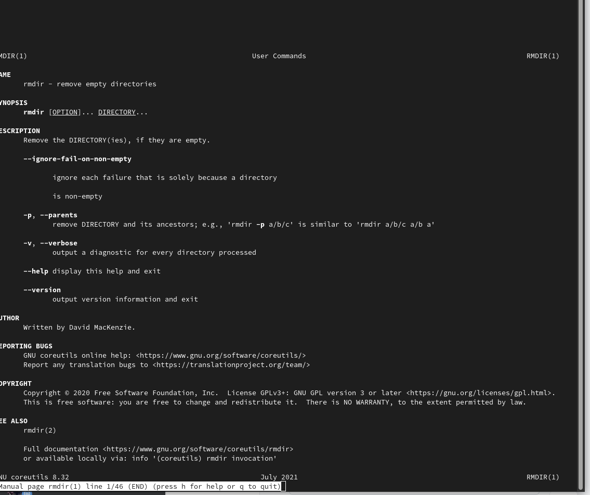
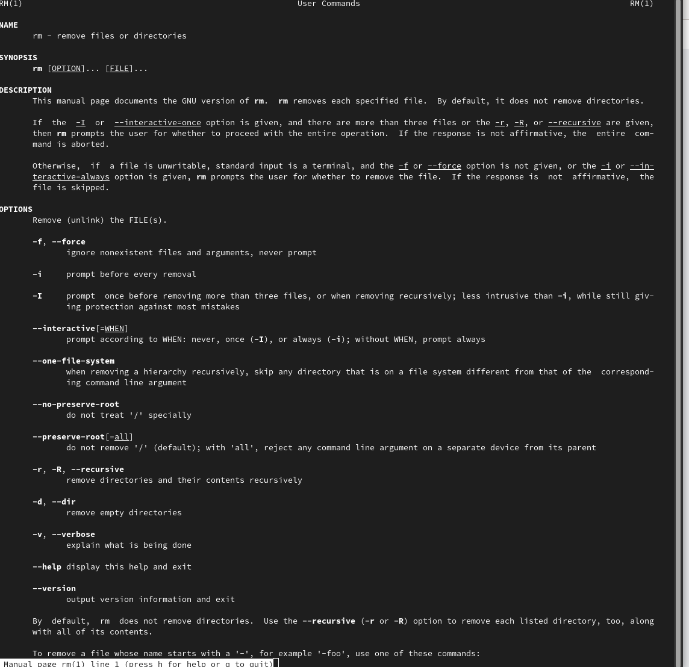

## 7. Используя информацию, полученную при помощи команды history, выполняю модифаикацию и исполнение нескольких команд из буфера команд.
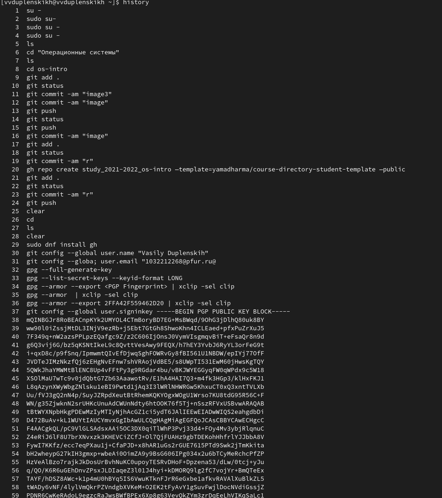
# Ответы на вопросы:
1.Интерфейс командной строки - управление программами с помощью команд. Команды состоят из букв, цифр, символов, набираются построчно, выполняются после нажатия клавиши Enter. Основной инструмент здесь клавиатура. Данный интерфейс встроен в ядро системы, он будет доступен, даже если графический интерфейс не запустится. Добраться до командной строки можно двумя способами: через консоль или терминал.

2.При помощи команды realpath можно определить абсолютный путь текущего каталога. Например, если вбить realpath var на экран выведется /home/<username>/var.

3. При помощи команды ls -F можно определить только тип файлов и их имена в текущем каталоге.
4. Файл (или директория) считается скрытым, если его название начинается с символа точка «.». Например, «.myfile». Обычно такие файлы используются приложениями для хранения настроек, конфигураций и другой информации, которую нужно скрыть от пользователя. Зачастую пользователю требуется отредактировать соответствующий конфигурационный скрытый файл, чтобы настроить какую-нибудь программу, и пользователи сталкиваются с тем, что не знают, как их вообще просмотреть. По умолчанию файловые менеджеры обычно не отображают такие файлы.
Для просмотра списка файлов в командной строке используется команда ls. Чтобы по команде ls также выводились скрытые файлы, существует опция -a.

5. При помощи команд rm и rmdir можно удалить файл и каталог. Это нельзя сделать одной и той же командой. rmdir используется, чтобы удалить файлы, которые должны быть пустые. rm используется, чтобы удалить непустые файлы или целые деревья каталогов.

6. Определить какие команды выполнил пользователь в сеансе работы можно с помощь команды history.

7. Исправить и запустить на выполнение команду, которую пользователь уже использовал в сеансе работы, можно с помощью команды: !<номер_команды>:s/<что_меняем>/<на_что_меняем> Например,
history
.
.
3 ls -a
.
.
!3:s/a/F
ls -F

8. В одной строке можно записать несколько команд. Если требуется выполнить последовательно несколько команд, записанный в одной строке, то для этого используется символ точка с запятой. Пример: cd; ls.
9.Экранирование — это способ заключения в кавычки одиночного символа. Экранирующий символ (\) сообщает интерпретатору, что следующий за ним символ должен восприниматься как обычный символ. Пример:
echo "Привет" # Привет
echo "Он сказал: \"Привет\"." # Он сказал: "Привет".

10. Если используется опция l в команде ls, то на экран выводится подробный список, в котором будет отображаться владелец, группа, дата создания, размер и другая информация о файлах и каталогах.

11. Относительный путь – это путь к файлу относительно текущей папки. При использовании команды pwd на экран выведется относительный путь текущей директории, а при использовании команды realpath на экран выведется абсолютный путь текущей директории.

12. Получить информацию об интересующей вас команде можно с помощью команды man. Например, команда man ls выведет все опции команды ls.

13. Сочетание клавиш Ctrl+C прерывает текущий процесс, запущенный в терминале.

# Вывод:
Мы приобрели практические навыки взаимодействия пользователя с системой посредством командной строки.
