---
## Front matter
lang: ru-RU
title: Отчёт по лабораторной работе №9
author: Аветисян Давид Артурович
institute: РУДН, Москва, Россия
date: 19 мая 2021

## Formatting
toc: false
slide_level: 2
theme: metropolis
header-includes: 
 - \metroset{progressbar=frametitle,sectionpage=progressbar,numbering=fraction}
 - '\makeatletter'
 - '\beamer@ignorenonframefalse'
 - '\makeatother'
aspectratio: 43
section-titles: true
---

# Цель работы

Познакомиться с операционной системой Linux. Получить практические навыки работы с редактором vi, установленным по умолчанию практически во всех дистрибутивах.

# Задание 1

1. Создаю каталог с именем ~/work/os/lab06.

2. Перехожу во вновь созданный каталог.
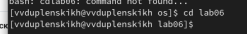

3. Вызываю vi и создаю файл hello.sh
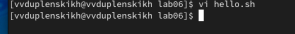

4. Нажимаю клавишу i и ввожу следующий текст.
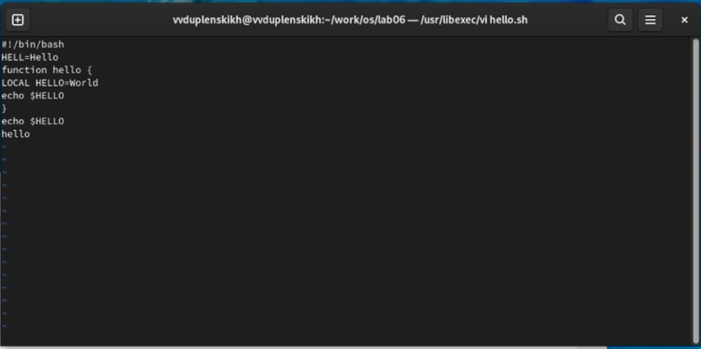

5. Нажимаю клавишу Esc для перехода в командный режим после завершения ввода текста.
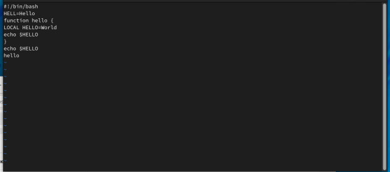

1. Нажимаю [:] для перехода в режим последней строки и внизу моего экрана появилось
приглашение в виде двоеточия.
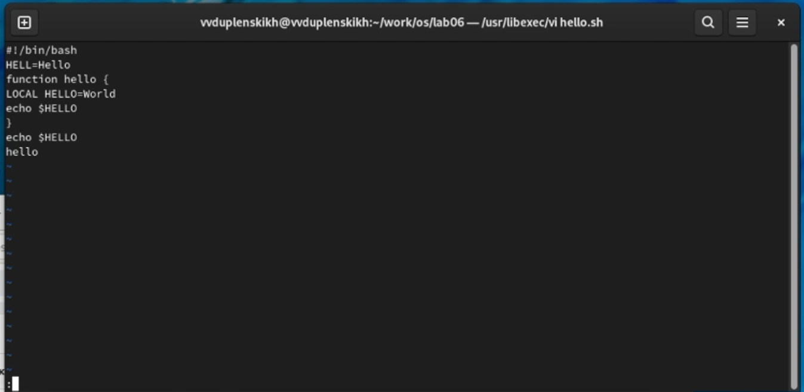

7. Нажимаю [w] (записать) и [q] (выйти), а затем нажимаю клавишу [Enter] для сохранения
моего текста и завершения работы.
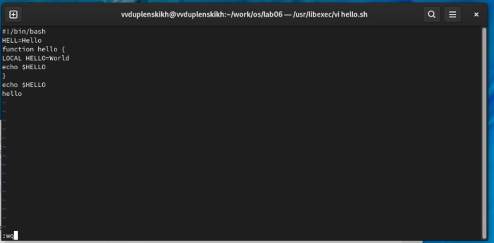

8. Делаю файл исполняемым.
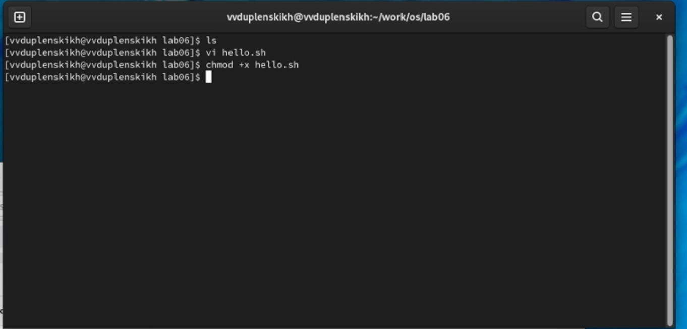

## Задание 2
1. Вызываю vi на редактирование файла
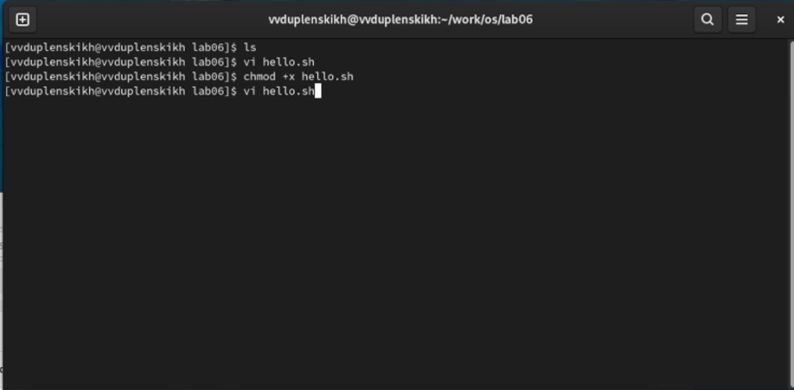

2. Устанавливаю курсор в конец слова HELL второй строки
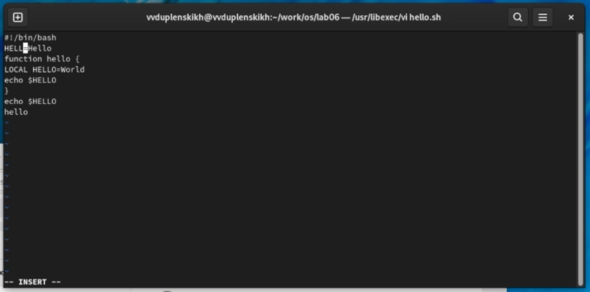

3. Перехожу в режим вставки и замените на HELLO. Нажимаю [Esc] для возврата в командный режим.
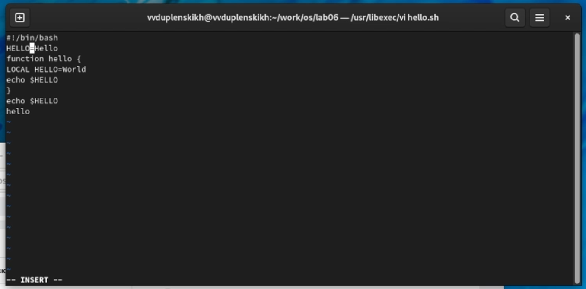

4. Устанавливаю курсор на четвертую строку и стираю слово LOCAL.
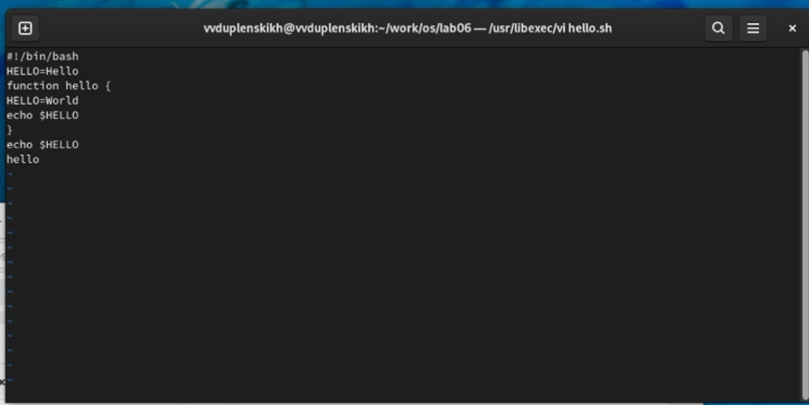

1. Перехожу в режим вставки и набираю следующий текст: local, нажимаю [Esc] для возврата в командный режим.
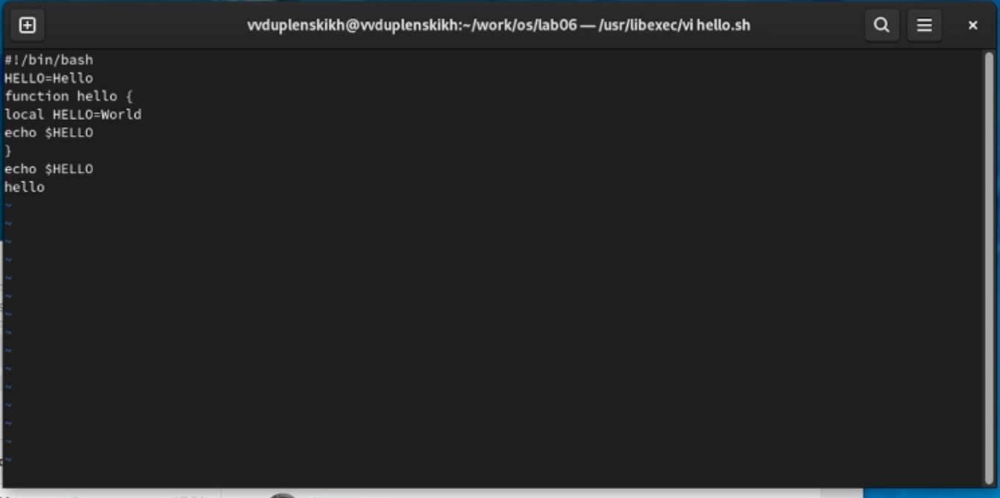

6. Устанавливаю курсор на последней строке файла. Вставляю после неё строку, содержащую следующий текст: echo $HELLO.
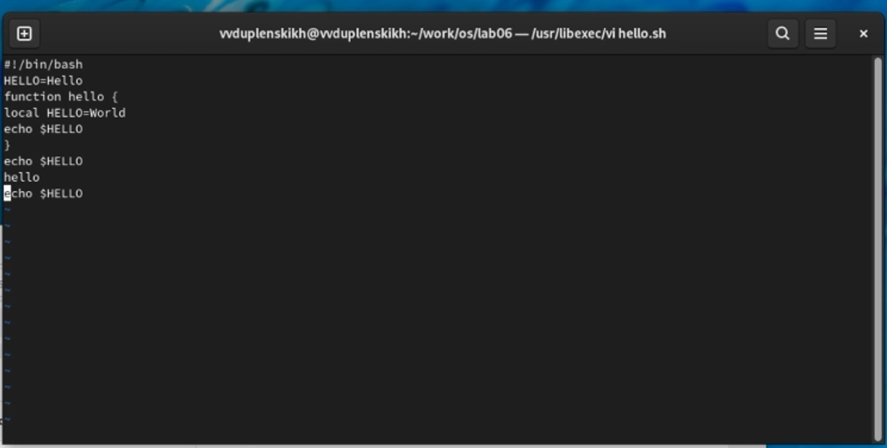

7. Нажимаю [Esc] для перехода в командный режим.
 

8. Удаляю последнюю строку
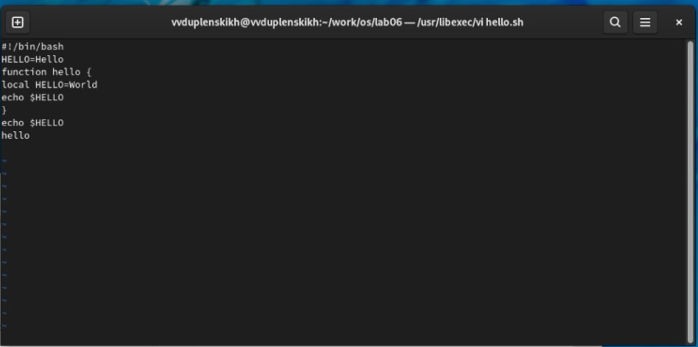 

9. Ввожу команду отмены изменений [u] для отмены последней команды.
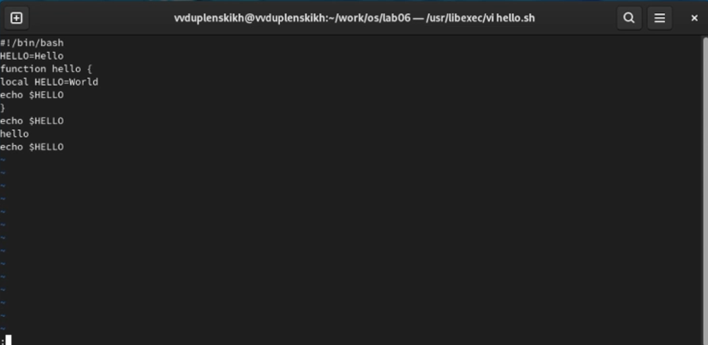 

10. Ввожу символ [:] для перехода в режим последней строки. Записываю произведённые изменения и выхожу из vi.
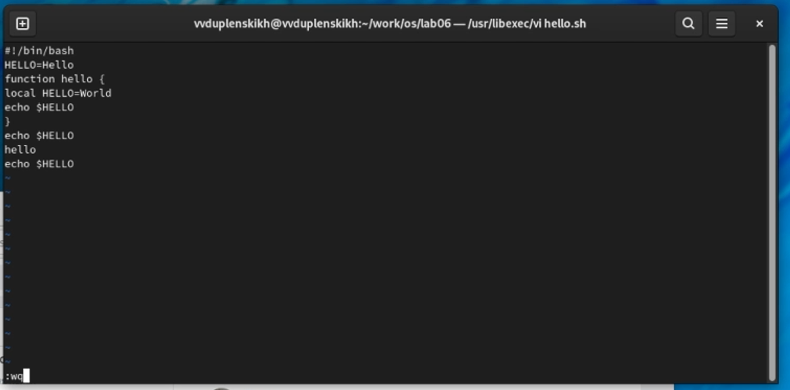   

# Выводы

В ходе выполнения лабораторной работы №8 я познакомился с операционной системой Linux и получил практические навыки работы с редактором vi.

