---
## Front matter
lang: ru-RU
title: Отчёт по лабораторной работе №9
author: Дупленских Василий Викторович
institute: РУДН, Москва, Россия
date: 20 мая 2022

## Formatting
toc: false
slide_level: 2
theme: metropolis
header-includes: 
 - \metroset{progressbar=frametitle,sectionpage=progressbar,numbering=fraction}
 - '\makeatletter'
 - '\beamer@ignorenonframefalse'
 - '\makeatother'
aspectratio: 43
section-titles: true
---
# Цель работы:

Познакомиться с операционной системой Linux. Получить практические навыки работы с редактором Emacs.

# Выполнение лабораторной работы:

## 1. Открываю emacs:
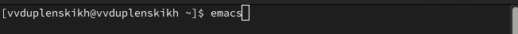

## 2. Создаю файл lab07.sh с помощью комбинации Ctrl-x Ctrl-f:
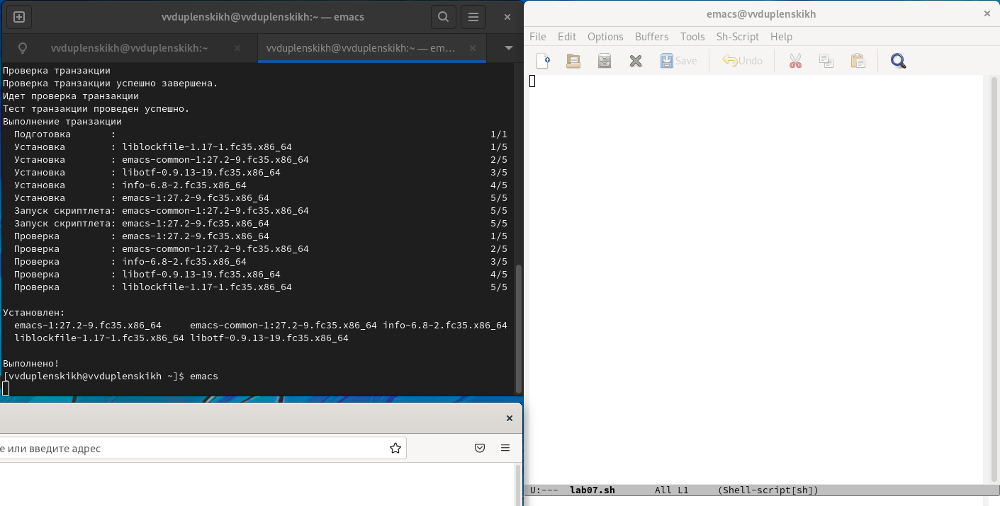

## 3. Набираю текст:
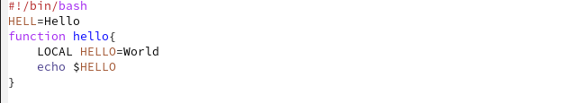

## 4. Сохраняю файл с помощью комбинации Ctrl-x Ctrl-s:
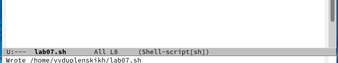

## 5. Проделываю с текстом стандартные процедуры редактирования, каждое действие осуществляю комбинацией клавиш.
### 5.1 Вырезаю одной командой целую строку:
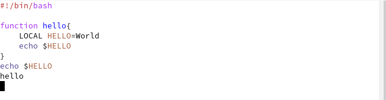

### 5.2. Вставляю эту строку в конец файла:
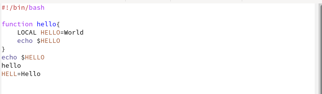

### 5.3. Выделяю область текста:
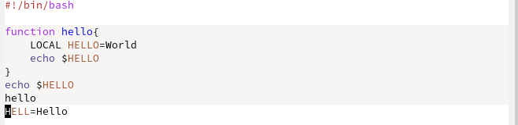

### 5.4. Копирую область в буфер обмена:

### 5.5. Вставляю область в конец файла:
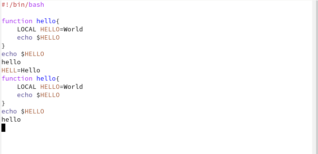

### 5.6. Вновь выделяю эту область и на этот раз вырезаю её:
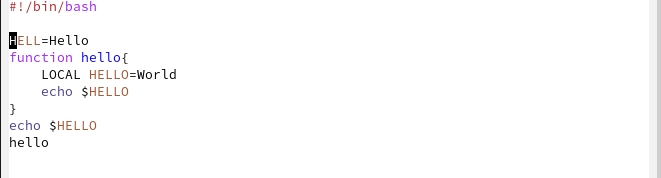

### 5.7. Отменяю последнее действие:
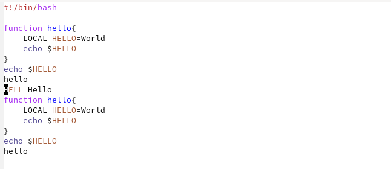

## 6. Использую команды по перемещению курсора:
### 6.1. Перемещаю курсор в начало строки:
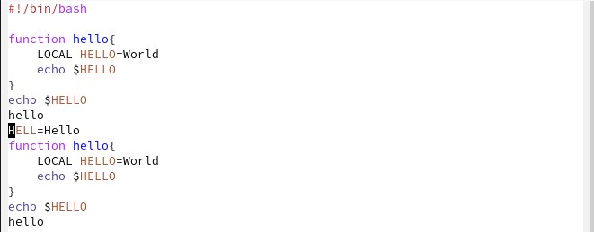

### 6.2. Перемещаю курсор в конец строки:
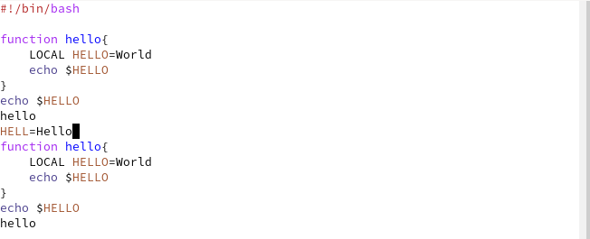

### 6.3. Перемещаю курсор в начало буфера:
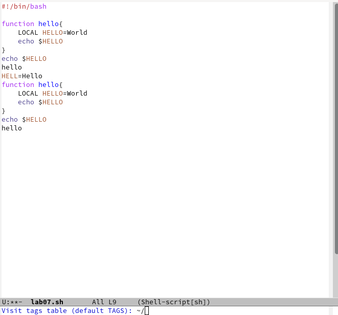

### 6.4. Перемещаю курсор в конец буфера:

## 7. Управляю буферами:
### 7.1. Вывожу список активных буферов на экран:
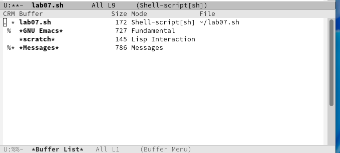

### 7.2. Перемещаюсь во вновь открытое окно со списком открытых буферов
и переключаюсь на другой буфер:
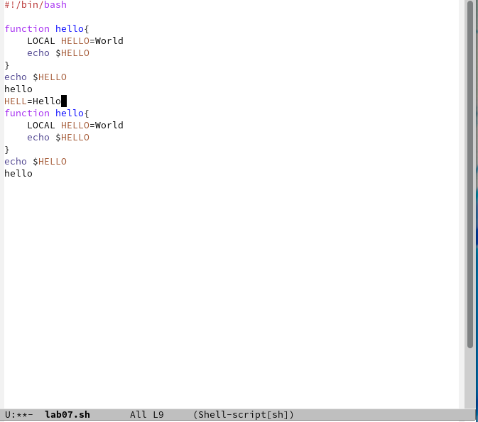

### 7.3. Закрываю это окно:
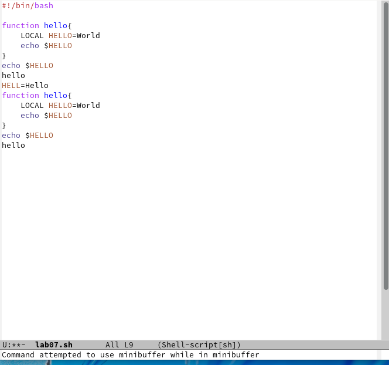

### 7.4. Теперь вновь переключаюсь между буферами, но уже без вывода их списка на экран:
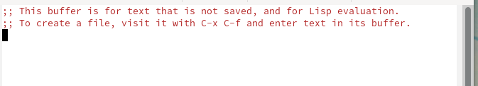

## 8. Управляю окнами:
### 8.1. Поделите фрейм на 4 части: разделите фрейм на два окна по вертикали,
а затем каждое из этих окон на две части по горизонтали:
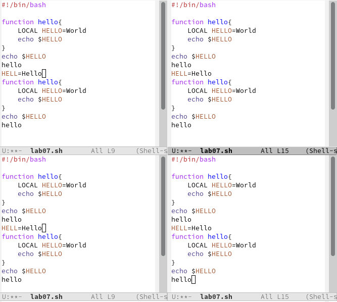

### 8.2. В каждом из четырёх созданных окон открываю новый буфер (файл) и ввожу несколько строк текста:

## 9. Режим поиска:
### 9.1. Переключаюсь в режим поиска и ищу несколько слов, присутствующих в тексте:

### 9.2. Переключаюсь между результатами поиска:
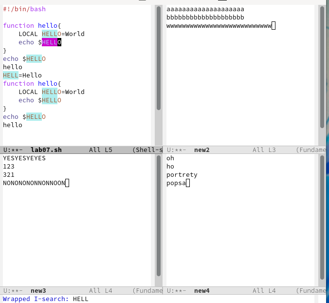

### 9.3. Выхожу из режима поиска:
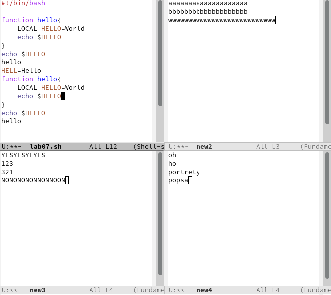

### 9.4. Перехожу в режим поиска и замены, ввожу текст, который следует найти
и заменить, нажимаю Enter , затем ввожу текст для замены. После того как будут подсвечены результаты поиска, нажимаю ! для подтверждения замены:
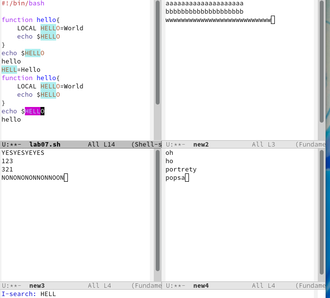

### 9.5. Отпробываю другой режим поиска:

# Вывод:
Я познакомился с операционной системой Linux. Получил практические навыки работы с редактором Emacs!
