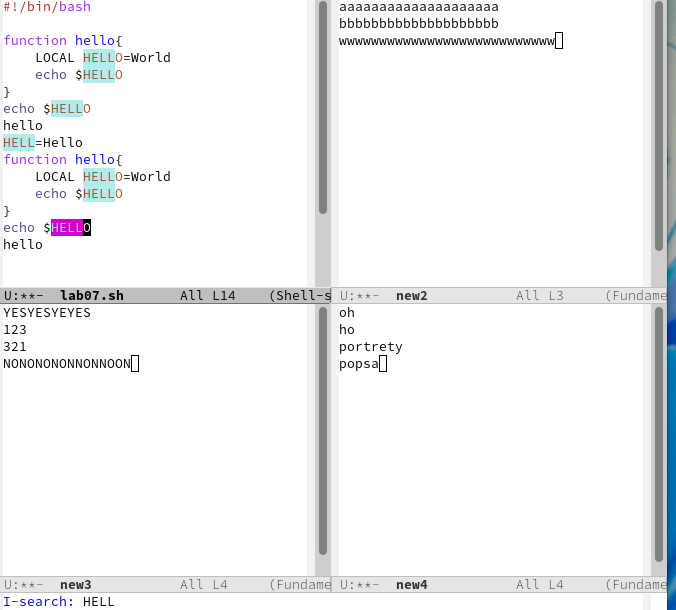
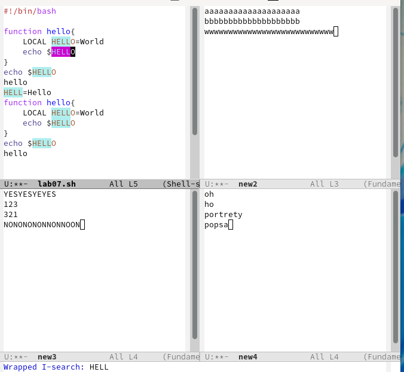

---
## Front matter
title: "Отчёт по лабораторной работе №9"
subtitle: "Текстовой редактор Emacs"
author: "Дупленских Василий Викторович"

## Generic otions
lang: ru-RU
toc-title: "Содержание"

## Bibliography
bibliography: bib/cite.bib
csl: pandoc/csl/gost-r-7-0-5-2008-numeric.csl

## Pdf output format
toc: true # Table of contents
toc-depth: 2
lof: true # List of figures
lot: true # List of tables
fontsize: 12pt
linestretch: 1.5
papersize: a4
documentclass: scrreprt
## I18n polyglossia
polyglossia-lang:
  name: russian
  options:
	- spelling=modern
	- babelshorthands=true
polyglossia-otherlangs:
  name: english
## I18n babel
babel-lang: russian
babel-otherlangs: english
## Fonts
mainfont: PT Serif
romanfont: PT Serif
sansfont: PT Sans
monofont: PT Mono
mainfontoptions: Ligatures=TeX
romanfontoptions: Ligatures=TeX
sansfontoptions: Ligatures=TeX,Scale=MatchLowercase
monofontoptions: Scale=MatchLowercase,Scale=0.9
## Biblatex
biblatex: true
biblio-style: "gost-numeric"
biblatexoptions:
  - parentracker=true
  - backend=biber
  - hyperref=auto
  - language=auto
  - autolang=other*
  - citestyle=gost-numeric
## Pandoc-crossref LaTeX customization
figureTitle: "Рис."
tableTitle: "Таблица"
listingTitle: "Листинг"
lofTitle: "Список иллюстраций"
lotTitle: "Список таблиц"
lolTitle: "Листинги"
## Misc options
indent: true
header-includes:
  - \usepackage{indentfirst}
  - \usepackage{float} # keep figures where there are in the text
  - \floatplacement{figure}{H} # keep figures where there are in the text
---

# Цель работы:

Познакомиться с операционной системой Linux. Получить практические навыки работы с редактором Emacs.

# Выполнение лабораторной работы:

## 1. Открываю emacs:

## 2. Создаю файл lab07.sh с помощью комбинации Ctrl-x Ctrl-f:

## 3. Набираю текст:

## 4. Сохраняю файл с помощью комбинации Ctrl-x Ctrl-s:

## 5. Проделываю с текстом стандартные процедуры редактирования, каждое действие осуществляю комбинацией клавиш.
### 5.1 Вырезаю одной командой целую строку:

### 5.2. Вставляю эту строку в конец файла:

### 5.3. Выделяю область текста:

### 5.4. Копирую область в буфер обмена:

### 5.5. Вставляю область в конец файла:

### 5.6. Вновь выделяю эту область и на этот раз вырезаю её:

### 5.7. Отменяю последнее действие:

## 6. Использую команды по перемещению курсора:
### 6.1. Перемещаю курсор в начало строки:

### 6.2. Перемещаю курсор в конец строки:

### 6.3. Перемещаю курсор в начало буфера:

### 6.4. Перемещаю курсор в конец буфера:

## 7. Управляю буферами:
### 7.1. Вывожу список активных буферов на экран:

### 7.2. Перемещаюсь во вновь открытое окно со списком открытых буферов
и переключаюсь на другой буфер:

### 7.3. Закрываю это окно:

### 7.4. Теперь вновь переключаюсь между буферами, но уже без вывода их списка на экран:

## 8. Управляю окнами:
### 8.1. Поделите фрейм на 4 части: разделите фрейм на два окна по вертикали,
а затем каждое из этих окон на две части по горизонтали:

### 8.2. В каждом из четырёх созданных окон открываю новый буфер (файл) и ввожу несколько строк текста:

## 9. Режим поиска:
### 9.1. Переключаюсь в режим поиска и ищу несколько слов, присутствующих в тексте:

### 9.2. Переключаюсь между результатами поиска:

### 9.3. Выхожу из режима поиска:

### 9.4. Перехожу в режим поиска и замены, ввожу текст, который следует найти
и заменить, нажимаю Enter , затем ввожу текст для замены. После того как будут подсвечены результаты поиска, нажимаю ! для подтверждения замены:

### 9.5. Отпробываю другой режим поиска:

# Ответы на вопросы:
1. Кратко охарактеризуйте редактор emacs. Ответ: Emacs представляет собой мощный экранный редактор текста, написанный на языке высокого уровня Elisp.

2. Какие особенности данного редактора могут сделать его сложным для освоения новичком? Ответ: Сложным освоение данной программы для новичка может сделать незнание комбинации клавиш или английского.

3. Своими словами опишите, что такое буфер и окно в терминологии emacs’а Ответ: Моими словами буфер это динамическая память, а окно- то, что мы видим

4. Можно ли открыть больше 10 буферов в одном окне? Ответ: Можно если нет ограничений на систему.

5. Какие буферы создаются по умолчанию при запуске emacs? Ответ: Буферы, которые открываются по умолчанию: GNU Emacs, scratch, Messages, Quail Completions

6. Какие клавиши вы нажмёте, чтобы ввести следующую комбинацию C-c | и C-c C-|? Ответ: Сtrl+c, Shift+\ и Ctrl+c Ctrl+\

7. Как поделить текущее окно на две части? Ответ: Нажать C-x 3, или C-x 2.

8. В каком файле хранятся настройки редактора emacs? Ответ: Настройки хранятся в файле ~/.emacs.

9. Какую функцию выполняет клавиша Backspace и можно ли её переназначить? Ответ: Перемещение курсора

10. Какой редактор вам показался удобнее в работе vi или emacs? Поясните почему. Ответ: Редактор emacs ,потому что на нем можно работать сразу с несколькими файлами.

# Вывод:
Я познакомился с операционной системой Linux. Получил практические навыки работы с редактором Emacs!
