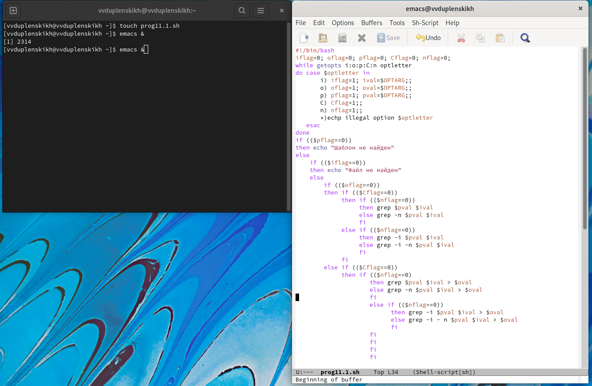
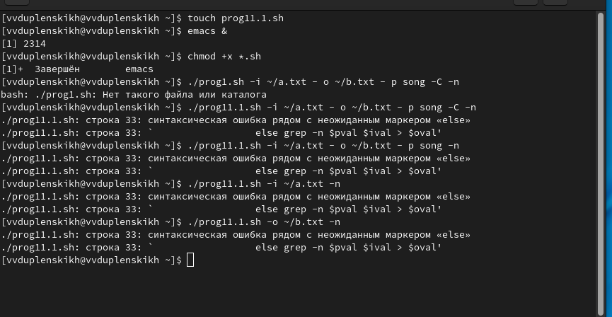
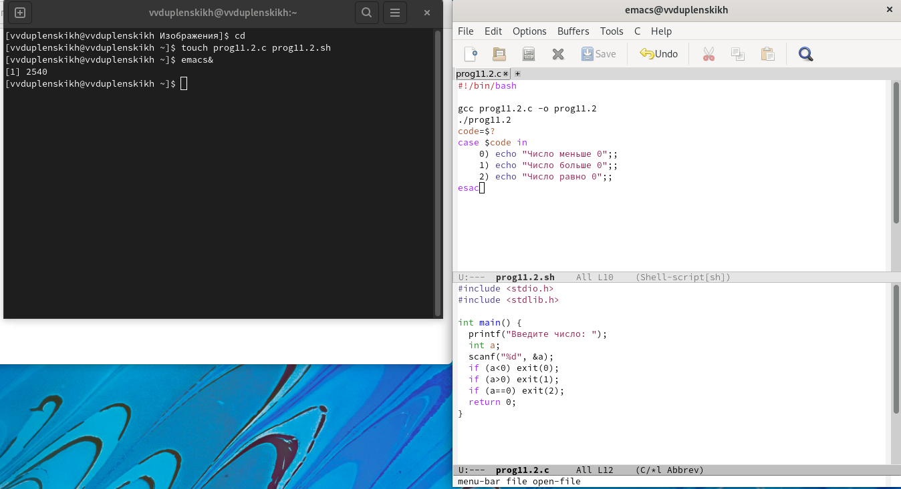
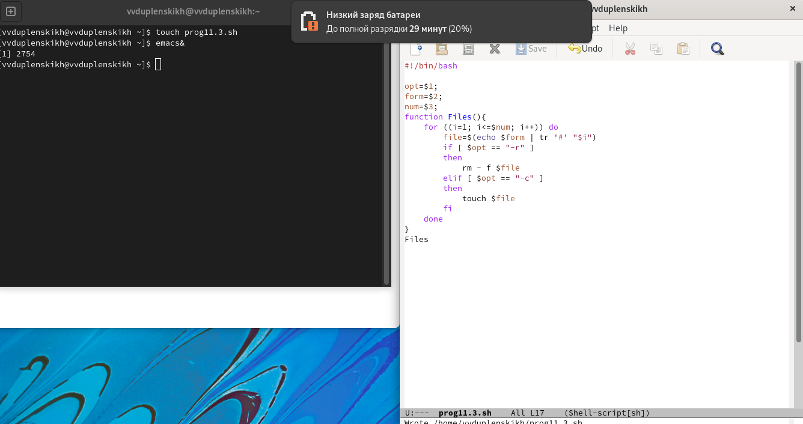
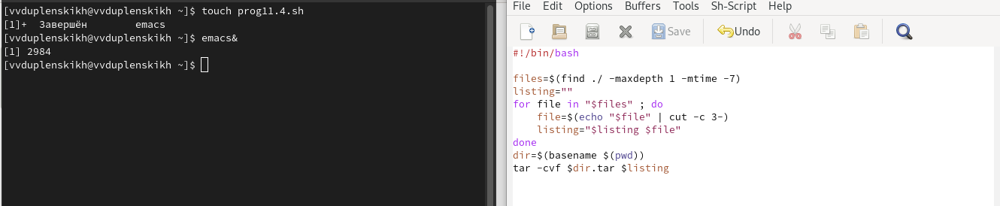

---
## Front matter
lang: ru-RU
title: Отчёт по лабораторной работе №11
author: Дупленских Василий Викторович
institute: РУДН, Москва, Россия
date: 25 мая 2022

## Formatting
toc: false
slide_level: 2
theme: metropolis
header-includes: 
 - \metroset{progressbar=frametitle,sectionpage=progressbar,numbering=fraction}
 - '\makeatletter'
 - '\beamer@ignorenonframefalse'
 - '\makeatother'
aspectratio: 43
section-titles: true
---

# Цель работы:

Изучить основы программирования в оболочке ОС UNIX. Научится писать более
сложные командные файлы с использованием логических управляющих конструкций
и циклов.

# Выполнение лабораторной работы:
## 1.1. Используя команды getopts grep пишу командный файл который анализирует командную строку с ключами -i -o -p -C -n:

## 1.2. Проверяю работу программы, которая читает данные, выводит, читает поискоый шаблон, различает большие и малые буквы и выдает номера строк:

## 2.1. Пишу программу на c и в оболочке, которая сравнивает число с 0:

## 2.2. Проверяю вторую программу:
![Программа 2 в действии(image/2.2.png)

## 3.1. Пишу программу, которая создает и удаляет заданное количество файлов:

## 3.2. Проверяю третью программу:
![Программа 3 в действии(image/3.2.png)

## 4.1. Пишу программу-архиватор, архивирующая все, что назодится в папке, но младше 7 дней:

## 4.2. Проверяю четвертую программу:
![Программа 4 в действии(image/4.2.png)

# Вывод:
Я изучил основы программирования в оболоочке ОС UNIX/Linux. Также научился писать более сложные командные файлы с использованием логических управляющих конструкций и циклов.
