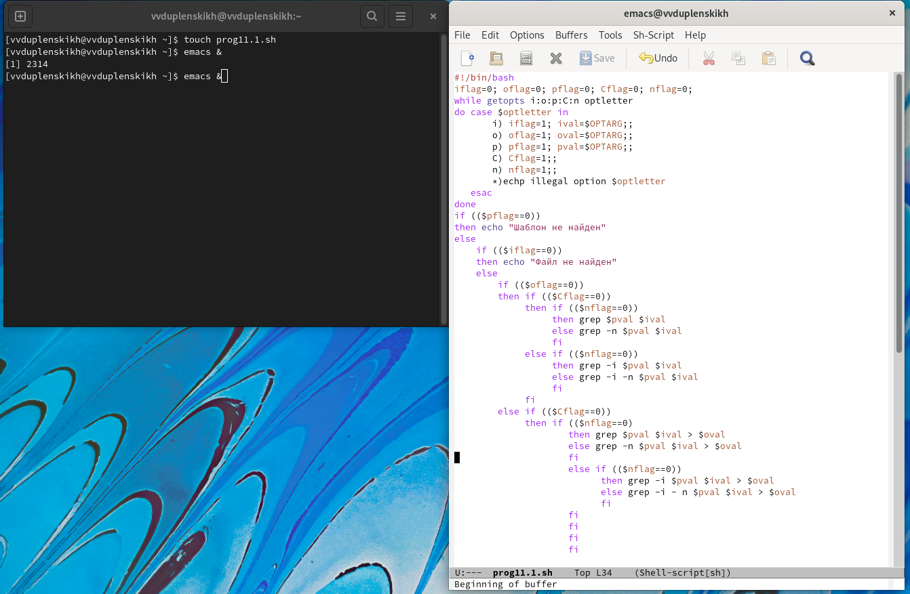
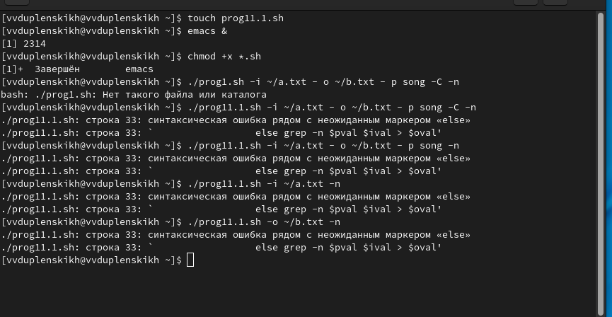
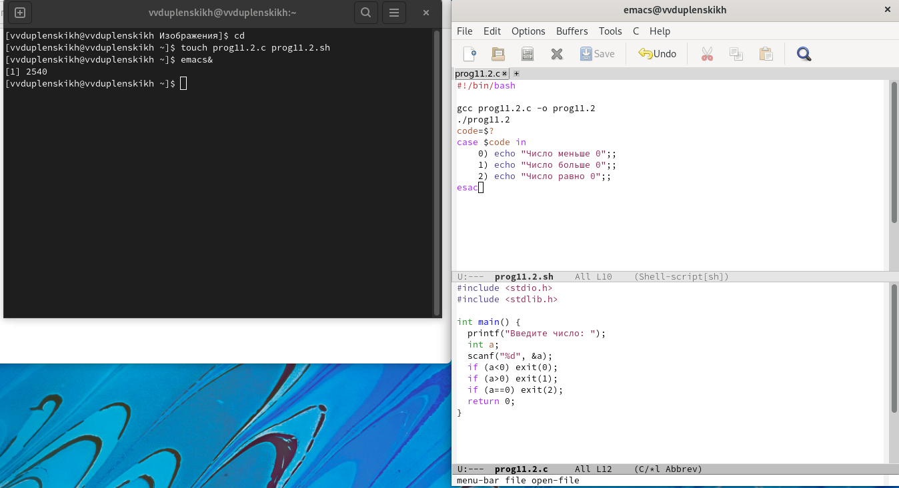
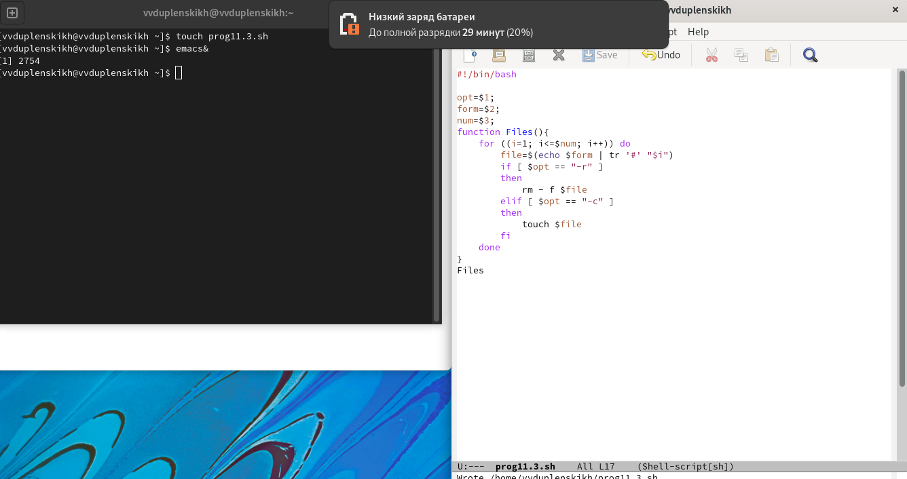
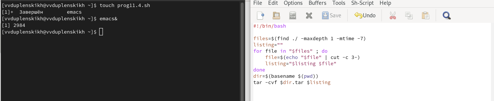

---
# Front matter
lang: ru-RU
title: "Отчёт по лабораторной работе №11"
subtitle: "Дисциплина: Операционные системы"
author: "Дупленских Василий Викторович"

# Formatting
toc-title: "Содержание"
toc: true # Table of contents
toc_depth: 2
lof: true # List of figures
lot: true # List of tables
fontsize: 12pt
linestretch: 1.5
papersize: a4paper
documentclass: scrreprt
polyglossia-lang: russian
polyglossia-otherlangs: english
mainfont: PT Serif
romanfont: PT Serif
sansfont: PT Sans
monofont: PT Mono
mainfontoptions: Ligatures=TeX
romanfontoptions: Ligatures=TeX
sansfontoptions: Ligatures=TeX,Scale=MatchLowercase
monofontoptions: Scale=MatchLowercase
indent: true
pdf-engine: lualatex
header-includes:
  - \linepenalty=10 # the penalty added to the badness of each line within a paragraph (no associated penalty node) Increasing the value makes tex try to have fewer lines in the paragraph.
  - \interlinepenalty=0 # value of the penalty (node) added after each line of a paragraph.
  - \hyphenpenalty=50 # the penalty for line breaking at an automatically inserted hyphen
  - \exhyphenpenalty=50 # the penalty for line breaking at an explicit hyphen
  - \binoppenalty=700 # the penalty for breaking a line at a binary operator
  - \relpenalty=500 # the penalty for breaking a line at a relation
  - \clubpenalty=150 # extra penalty for breaking after first line of a paragraph
  - \widowpenalty=150 # extra penalty for breaking before last line of a paragraph
  - \displaywidowpenalty=50 # extra penalty for breaking before last line before a display math
  - \brokenpenalty=100 # extra penalty for page breaking after a hyphenated line
  - \predisplaypenalty=10000 # penalty for breaking before a display
  - \postdisplaypenalty=0 # penalty for breaking after a display
  - \floatingpenalty = 20000 # penalty for splitting an insertion (can only be split footnote in standard LaTeX)
  - \raggedbottom # or \flushbottom
  - \usepackage{float} # keep figures where there are in the text
  - \floatplacement{figure}{H} # keep figures where there are in the text
---

# Цель работы:

Изучить основы программирования в оболочке ОС UNIX. Научится писать более
сложные командные файлы с использованием логических управляющих конструкций
и циклов.

# Выполнение лабораторной работы:
## 1.1. Используя команды getopts grep пишу командный файл который анализирует командную строку с ключами -i -o -p -C -n:

## 1.2. Проверяю работу программы, которая читает данные, выводит, читает поискоый шаблон, различает большие и малые буквы и выдает номера строк:

## 2.1. Пишу программу на c и в оболочке, которая сравнивает число с 0:

## 2.2. Проверяю вторую программу:
![Программа 2 в действии(image/2.2.png)

## 3.1. Пишу программу, которая создает и удаляет заданное количество файлов:

## 3.2. Проверяю третью программу:
![Программа 3 в действии(image/3.2.png)

## 4.1. Пишу программу-архиватор, архивирующая все, что назодится в папке, но младше 7 дней:

## 4.2. Проверяю четвертую программу:
![Программа 4 в действии(image/4.2.png)

# Ответы на вопросы:
1. Команда getopts осуществляет синтаксический анализ командной строки, выделяя флаги, и используется для объявления переменных. Синтаксис команды следующий:
getopts option-string variable [arg ... ]
Флаги − это опции командной строки, обычно помеченные знаком минус; Например, для команды ls флагом может являться -F.
Строка опций option-string − это список возможных букв и чисел соответствующего флага. Если ожидается, что некоторый флаг будет сопровождаться некоторым аргументом, то за символом, обозначающим этот флаг, должно следовать двоеточие. Соответствующей переменной присваивается буква данной опции. Если команда getopts может распознать аргумент, то она возвращает истину. Принято включать getopts в цикл while и анализировать введённые данные с помощью оператора case.
Функция getopts включает две специальные переменные среды − OPTARG и OPTIND. Если ожидается дополнительное значение, то OPTARG устанавливается в значение этого аргумента.
Функция getopts также понимает переменные типа массив, следовательно, можно использовать её в функции не только для синтаксического анализа аргументов функций, но и для анализа введённых пользователем данных.
2. При перечислении имён файлов текущего каталога можно использовать следующие символы:
- * − соответствует произвольной, в том числе и пустой строке;
- ? − соответствует любому одинарному символу;
- [c1-c2] − соответствует любому символу, лексикографически находящемуся между символами с1 и с2.
Например,
- echo * − выведет имена всех файлов текущего каталога, что представляет собой простейший аналог команды ls;
- ls *.c − выведет все файлы с последними двумя символами, совпадающими с .c.
- echo prog.? − выведет все файлы, состоящие из пяти или шести символов, первыми пятью символами которых являются prog..
- [a-z]* − соответствует произвольному имени файла в текущем каталоге, начинающемуся с любой строчной буквы латинского алфавита.
3. Часто бывает необходимо обеспечить проведение каких-либо действий циклически и управление дальнейшими действиями в зависимости отрезультатов проверки некоторого условия. Для решения подобных задач язык программирования bash предоставляет возможность использовать такие управляющие конструкции, как for, case, if и while. С точки зрения командного процессора эти управляющие конструкции являются обычными командами и могут использоваться как при создании командных файлов, так и при работе в интерактивном режиме. Команды, реализующие подобные конструкции, по сути, являются операторами языка программирования bash. Поэтому при описании языка программирования bash термин оператор будет использоваться наравне с термином команда.
Команды ОС UNIX возвращают код завершения, значение которого может быть использовано для принятия решения о дальнейших действиях. Команда test, например, создана специально для использования в командных файлах. Единственная функция этой команды заключается в выработке кода завершения.
4. Два несложных способа позволяют вам прерывать циклы в оболочке bash.
Команда break завершает выполнение цикла, а команда continue завершает данную итерацию блока операторов.
Команда break полезна для завершения цикла while в ситуациях, когда условие перестаёт быть правильным.
Команда continue используется в ситуациях, когда больше нет необходимости выполнять блок операторов, но вы можете захотеть продолжить проверять данный блок на других условных выражениях.
5. Следующие две команды ОС UNIX используются только совместно с управляющими конструкциями языка программирования bash: это команда true, которая всегда возвращает код завершения, равный нулю (т.е. истина), и команда false, которая всегда возвращает код завершения, не равный нулю (т. е. ложь).
Примеры бесконечных циклов:
while true
do echo hello andy
done
until false
do echo hello mike
done
6. Строка if test -f man$s/$i.$s проверяет, существует ли файл man$s/$i.$s и является ли этот файл обычным файлом. Если данный файл является каталогом, то команда вернет нулевое значение (ложь).
7. Выполнение оператора цикла while сводится к тому, что сначала выполняется последовательность команд (операторов), которую задаёт список-команд в строке, содержащей служебное слово while, а затем, если последняя выполненная команда из этой последовательности команд возвращает нулевой код завершения (истина), выполняется последовательность команд (операторов), которую задаёт список-команд в строке, содержащей служебное слово do, после чего осуществляется безусловный переход на начало оператора цикла while. Выход из цикла будет осуществлён тогда, когда последняя выполненная команда из последовательности команд (операторов), которую задаёт список-команд в строке, содержащей служебное слово while, возвратит ненулевой код завершения (ложь).
    При замене в операторе цикла while служебного слова while на until условие, при выполнении которого осуществляется выход из цикла, меняется на противоположное. В остальном оператор цикла while и оператор цикла until идентичны.

Еще

# Вывод:
Я изучил основы программирования в оболоочке ОС UNIX/Linux. Также научился писать более сложные командные файлы с использованием логических управляющих конструкций и циклов.
