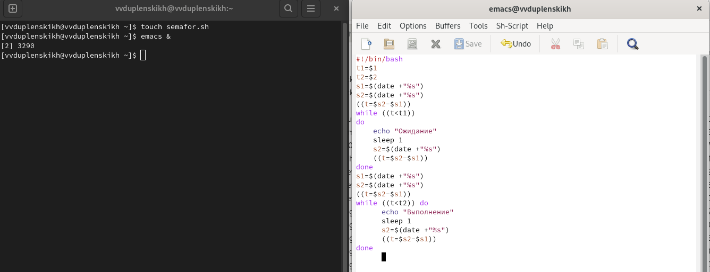
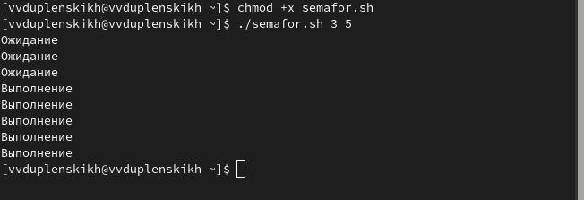
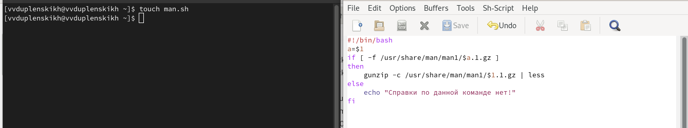
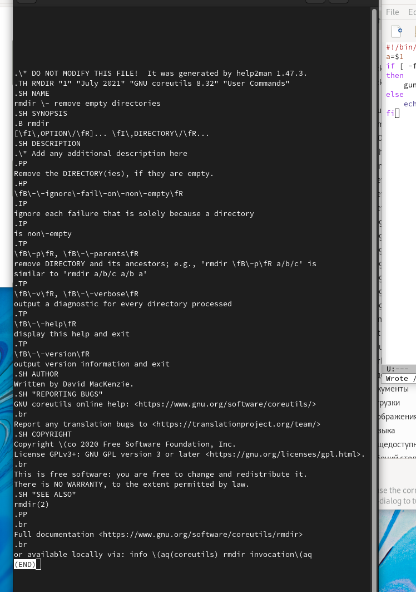
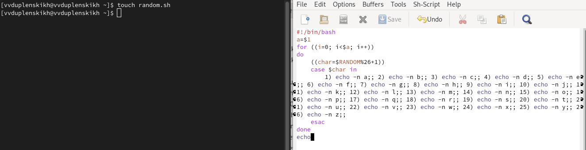
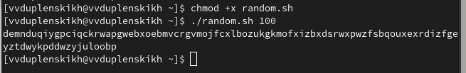

---
## Front matter
lang: ru-RU
title: Отчёт по лабораторной работе №12
author: Дупленских Василий Викторович
institute: РУДН, Москва, Россия
date: 26 мая 2022

## Formatting
toc: false
slide_level: 2
theme: metropolis
header-includes: 
 - \metroset{progressbar=frametitle,sectionpage=progressbar,numbering=fraction}
 - '\makeatletter'
 - '\beamer@ignorenonframefalse'
 - '\makeatother'
aspectratio: 43
section-titles: true
---

# Цель работы:

Изучить основы программирования в оболочке ОС UNIX. Научиться писать более
сложные командные файлы с использованием логических управляющих конструкций
и циклов.

# Выполнение лабораторной работы:

## 1.1. Создаю новый текстовый файл semafor.sh и запускаю emacs:

## 1.2. Пишу скрипт который при запуске будет показывать упрощенный механизм семафора:

## 2.1. Создаю новый текстовый файл man.sh и запускаю emacs:

## 2.2. Пишу скрипт который показывает справку по введенной команде:

## 3.1. Создаю новый текстовый файл random.sh и запускаю emacs:

## 3.2. Проверяю третий скрпит:

# Вывод:
Я изучил основы программирования в оболочке ОС UNIX. Также Научился писать более
сложные командные файлы с использованием логических управляющих конструкций
и циклов.
