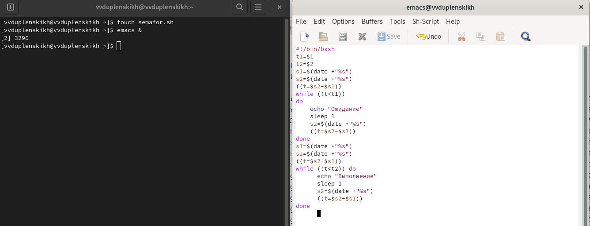

---
# Front matter
lang: ru-RU
title: "Отчёт по лабораторной работе №12"
subtitle: "Дисциплина: Операционные системы"
author: "Дупленских Василий Викторович"

# Formatting
toc-title: "Содержание"
toc: true # Table of contents
toc_depth: 2
lof: true # List of figures
lot: true # List of tables
fontsize: 12pt
linestretch: 1.5
papersize: a4paper
documentclass: scrreprt
polyglossia-lang: russian
polyglossia-otherlangs: english
mainfont: PT Serif
romanfont: PT Serif
sansfont: PT Sans
monofont: PT Mono
mainfontoptions: Ligatures=TeX
romanfontoptions: Ligatures=TeX
sansfontoptions: Ligatures=TeX,Scale=MatchLowercase
monofontoptions: Scale=MatchLowercase
indent: true
pdf-engine: lualatex
header-includes:
  - \linepenalty=10 # the penalty added to the badness of each line within a paragraph (no associated penalty node) Increasing the value makes tex try to have fewer lines in the paragraph.
  - \interlinepenalty=0 # value of the penalty (node) added after each line of a paragraph.
  - \hyphenpenalty=50 # the penalty for line breaking at an automatically inserted hyphen
  - \exhyphenpenalty=50 # the penalty for line breaking at an explicit hyphen
  - \binoppenalty=700 # the penalty for breaking a line at a binary operator
  - \relpenalty=500 # the penalty for breaking a line at a relation
  - \clubpenalty=150 # extra penalty for breaking after first line of a paragraph
  - \widowpenalty=150 # extra penalty for breaking before last line of a paragraph
  - \displaywidowpenalty=50 # extra penalty for breaking before last line before a display math
  - \brokenpenalty=100 # extra penalty for page breaking after a hyphenated line
  - \predisplaypenalty=10000 # penalty for breaking before a display
  - \postdisplaypenalty=0 # penalty for breaking after a display
  - \floatingpenalty = 20000 # penalty for splitting an insertion (can only be split footnote in standard LaTeX)
  - \raggedbottom # or \flushbottom
  - \usepackage{float} # keep figures where there are in the text
  - \floatplacement{figure}{H} # keep figures where there are in the text
---

# Цель работы:

Изучить основы программирования в оболочке ОС UNIX. Научиться писать более
сложные командные файлы с использованием логических управляющих конструкций
и циклов.

# Выполнение лабораторной работы:

## 1.1. Создаю новый текстовый файл semafor.sh и запускаю emacs:

## 1.2. Пишу скрипт который при запуске будет показывать упрощенный механизм семафора:

## 2.1. Создаю новый текстовый файл man.sh и запускаю emacs:

## 2.2. Пишу скрипт который показывает справку по введенной команде:

## 3.1. Создаю новый текстовый файл random.sh и запускаю emacs:

## 3.2. Проверяю третий скрпит:

# Ответы на вопросы:

1. while [$1 != "exit"]
В данной строчке допущены следующие ошибки:
- не хватает пробелов после первой скобки [ и перед второй скобкой ]
- выражение $1 необходимо взять в “”, потому что эта переменная может содержать пробелы
Таким образом, правильный вариант должен выглядеть так:
while [ “$1” != "exit" ]
2. Чтобы объединить несколько строк в одну, можно воспользоваться несколькими способами:
- Первый:
VAR1="Hello,"
VAR2=" World"
VAR3="$VAR1$VAR2"
echo "$VAR3"
Результат: Hello, World
- Второй:
VAR1="Hello, "
VAR1+=" World"
echo "$VAR1"
Результат: Hello, World
3. Команда seq в Linux используется для генерации чисел от ПЕРВОГО до ПОСЛЕДНЕГО шага INCREMENT.
Параметры:
- seq LAST: если задан только один аргумент, он создает числа от 1 до LAST с шагом шага, равным 1. Если LAST меньше 1, значение is не выдает.
- seq FIRST LAST: когда заданы два аргумента, он генерирует числа от FIRST до LAST с шагом 1, равным 1. Если LAST меньше FIRST, он не выдает никаких выходных данных.
- seq FIRST INCREMENT LAST: когда заданы три аргумента, он генерирует числа от FIRST до LAST на шаге INCREMENT. Если LAST меньше, чем FIRST, он не производит вывод.
- seq -f «FORMAT» FIRST INCREMENT LAST: эта команда используется для генерации последовательности в форматированном виде. FIRST и INCREMENT являются необязательными.
- seq -s «STRING» ПЕРВЫЙ ВКЛЮЧЕНО: Эта команда используется для STRING для разделения чисел. По умолчанию это значение равно /n. FIRST и INCREMENT являются необязательными.
- seq -w FIRST INCREMENT LAST: эта команда используется для выравнивания ширины путем заполнения начальными нулями. FIRST и INCREMENT являются необязательными.
4. Результатом данного выражения $((10/3)) будет 3, потому что это целочисленное деление без остатка.
5. Отличия командной оболочки zsh от bash:
- В zsh более быстрое автодополнение для cd с помощью Тab
- В zsh существует калькулятор zcalc, способный выполнять вычисления внутри терминала
- В zsh поддерживаются числа с плавающей запятой
- В zsh поддерживаются структуры данных «хэш»
- В zsh поддерживается раскрытие полного пути на основенеполных данных
- В zsh поддерживается замена части пути
- В zsh есть возможность отображать разделенный экран, такой же как разделенный экран vim
6. for ((a=1; a <= LIMIT; a++)) синтаксис данной конструкции верен, потому что, используя двойные круглые скобки, можно не писать $ перед переменными ().
7. Преимущества скриптового языка bash:
- Один из самых распространенных и ставится по умолчанию в большинстве дистрибутивах Linux, MacOS
- Удобное перенаправление ввода/вывода
- Большое количество команд для работы с файловыми системами Linux
- Можно писать собственные скрипты, упрощающие работу в Linux
Недостатки скриптового языка bash:
- Дополнительные библиотеки других языков позволяют выполнить больше действий
- Bash не является языков общего назначения
- Утилиты, при выполнении скрипта, запускают свои процессы, которые, в свою очередь, отражаются на быстроте выполнения этого скрипта
- Скрипты, написанные на bash, нельзя запустить на других операционных системах без дополнительных действий

# Вывод:
Я изучил основы программирования в оболочке ОС UNIX. Также Научился писать более
сложные командные файлы с использованием логических управляющих конструкций
и циклов.
