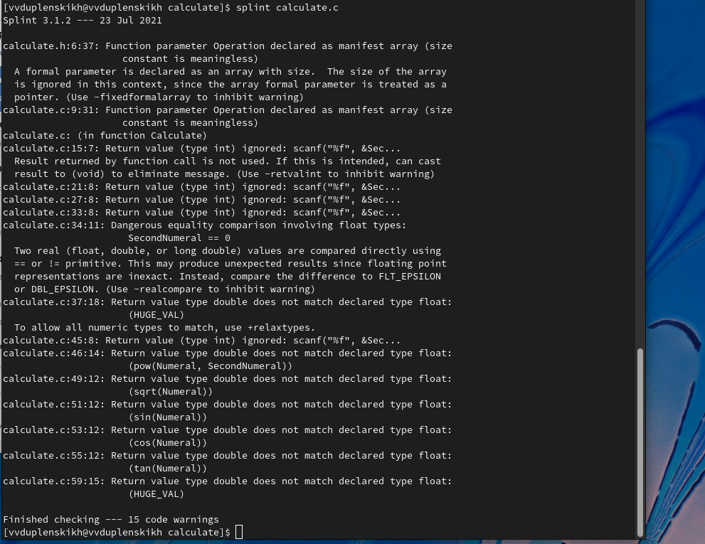

---
## Front matter
lang: ru-RU
title: Отчёт по лабораторной работе №13
author: Дупленских Василий Викторович
institute: РУДН, Москва, Россия
date: 03 июня 2022

## Formatting
toc: false
slide_level: 2
theme: metropolis
header-includes: 
 - \metroset{progressbar=frametitle,sectionpage=progressbar,numbering=fraction}
 - '\makeatletter'
 - '\beamer@ignorenonframefalse'
 - '\makeatother'
aspectratio: 43
section-titles: true
---

# Цель работы:

Приобрести простейшие навыки разработки, анализа, тестирования и отладки приложений в ОС типа UNIX/Linux на примере создания на языке программирования С калькулятора с простейшими функциями.

# Выполнение лабораторной работы:

## 1. Создаю новый подкаталог calculate в home и в нём уже создаю 3 файла:

## 2.1. Реализую калькулятор в файле calculate.c:

## 2.2. Описываю формат вызова функции калькулятора в файле calculate.h:

## 2.3. Реализую интерфейс пользователя к калькулятору в файле main.c:

## 3. Выполняю компиляцию программы посредством gcc:

## 4. Синтаксических ошибок нет, поэтому исправлять я ничего не собираюсь!

## 5. Создаю Makefile для компиляции в gdb:

## 6.1. Используя Makefile заново все компилирую:

## 6.2. Произвожу отладку через gdb:

## 7. Анализирую коды при помощи утилиты splint:

# Выводы:
Я приобрёл простейшие навыки разработки, анализа, тестирования и отладки приложений в ОС типа UNIX/Linux на примере создания на языке программирования С калькулятора с простейшими функциями.
