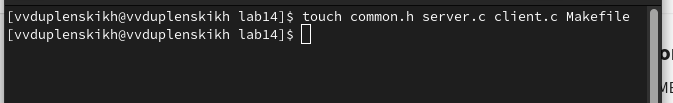
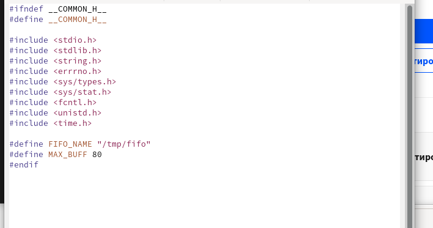
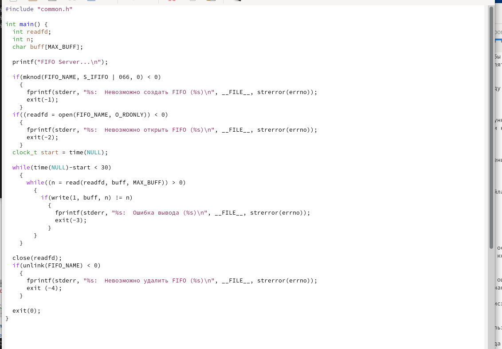
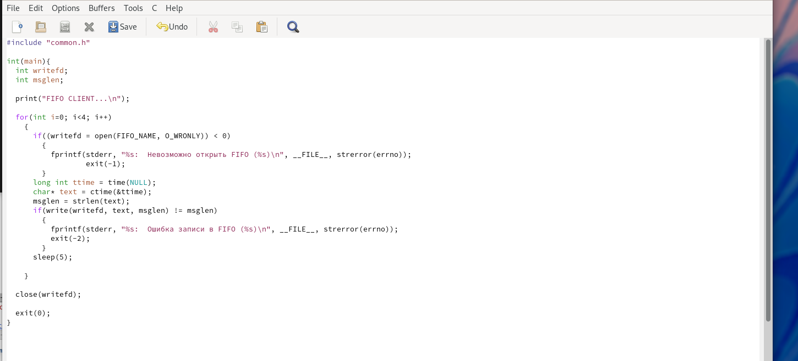
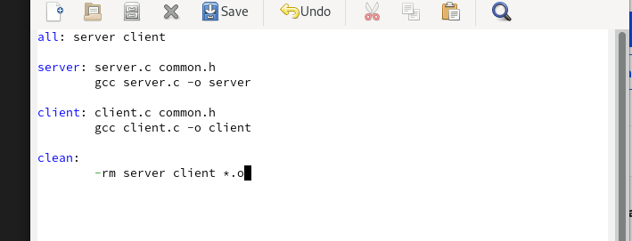
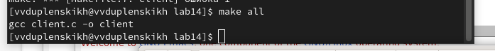
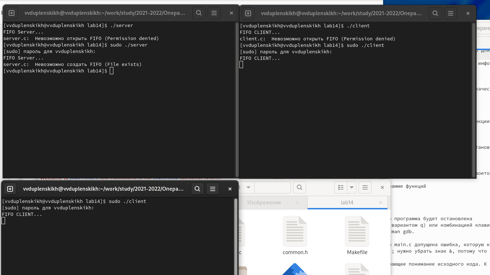

---
## Front matter
lang: ru-RU
title: Отчёт по лабораторной работе №14
author: Дупленских Василий Викторович
institute: РУДН, Москва, Россия
date: 03 июня 2022

## Formatting
toc: false
slide_level: 2
theme: metropolis
header-includes: 
 - \metroset{progressbar=frametitle,sectionpage=progressbar,numbering=fraction}
 - '\makeatletter'
 - '\beamer@ignorenonframefalse'
 - '\makeatother'
aspectratio: 43
section-titles: true
---

# Цель работы:

Приобретение практических навыков работы с именованными каналами.

# Выполнение лабораторной работы:

## 1. Создаю необходимые файлы с помощью команды touch и открываю их в редакторе emacs:

## 2.1. Изменяю файл common.h, который предназначен для заголовочных файлов, чтобы их не прописывать каждый раз:

## 2.2. Изменяю файл server.c, чтобы появилась возможность контроллировать время работы:

## 2.3. Изменяю файл client.h, конкретнее добавляю цикл, который отвечает за количество сообщений о текущем времени:

## 2.4. Пишу makefile для сборки(без изменений):

## 3.1. Выполняю компиляцию программы посредством make и gcc:

## 3.2. Проверяю работу написанного кода:

# Выводы:
Я приобрёл практические навыки работы с именованными каналами.
